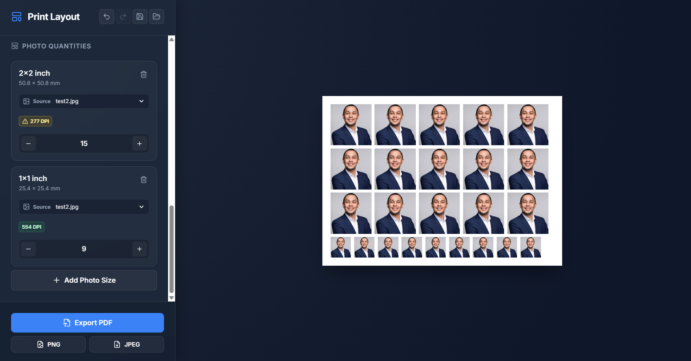

  

# Print Layout User Guide

Use Print Layout to place one or more photos on a printable sheet. You can make ID photos, passport photos, wallet photos, or mixed-size photo sheets, then download the result as a PDF, PNG, or JPEG.

## Before You Start

Have your photo files ready. The app accepts JPG, PNG, and WebP images.

For best printed quality, use a clear, high-resolution image. The app shows a DPI label beside each photo size:

- Green: good for the selected print size.
- Yellow: usable, but may look less sharp.
- Red: likely to look blurry when printed.

## Make a Photo Sheet

### 1. Add your photos

1. In **Source Images**, select **Add images**.
2. Choose one or more image files from your computer.
3. Each image appears in the source image list.

When you upload your first image, it is assigned automatically to the current photo sizes.

### 2. Choose your paper

In **Sheet Settings**, choose the paper you will actually print on.

Common choices:

- **A4** for standard document paper.
- **Short Bond** or **Long Bond** for bond paper.
- **3R**, **4R**, **5R**, and other R sizes for photo paper.
- **Portrait** for tall paper.
- **Landscape** for wide paper.

Choose the same paper size in your printer settings when you print.

### 3. Choose a ready-made layout

Under **Layout Templates**, select a template to quickly fill the page with one photo size:

- 1 x 1 Grid
- 1.5 x 1.5 Grid
- 2 x 2 Grid
- Passport Copies
- Wallet Print

The template automatically chooses the maximum number of copies that fits on the current paper with the current margin and spacing.

### 4. Add or change photo sizes

Under **Photo Quantities**:

- Use the **plus** button to add another copy.
- Use the **minus** button to remove a copy.
- Use the **trash** button to remove that photo size from the sheet.
- Select **Add Photo Size** to add a preset or enter a custom width and height in millimetres.

The app prevents you from adding a photo that will not fit on the selected paper.

## Use More Than One Image

Each photo size has a **Source** menu.

1. Find the photo size you want to change.
2. Open its **Source** menu.
3. Select the image that should be used for that size.

For example, you can use one person for 2 x 2 inch photos and another person for passport photos on the same page.

To use one uploaded image for every photo size, select **Use for all sizes** below that image in the source image list.

## Crop and Position a Photo

1. In **Source Images**, select the crop button beside the image.
2. Choose **Fill** to fill each photo box. This may crop the outer edges of the image.
3. Choose **Fit** to show the entire image. This may leave empty space around it.
4. Drag the image in the preview, or use the horizontal and vertical controls to move it.
5. Use **Zoom** to make the image larger or smaller.
6. Select **Apply Crop** when it looks right.

Crop changes apply everywhere that source image is used.

## Margins, Spacing, and Guides

### Margin

**Margin** is the empty area around the outside edge of the paper. Keep a margin if your printer cannot print all the way to the edge.

### Spacing

**Spacing** is the empty area between photo boxes. Increase it when you need room to cut out each photo.

If a new margin or spacing would make the current photos no longer fit, the app keeps your current settings and shows a message. It does not remove your photos.

### Cut marks and printable margin

These are optional visual guides:

- **Show cut marks in preview and export** adds small trim lines around photos.
- **Show printable margin in preview and export** adds a dashed rectangle around the safe printing area.

Leave both off for a clean sheet. Turn them on when you will cut the photos by hand.

## Save, Undo, and Redo

At the top of the sidebar:

- **Undo** returns to the previous layout change.
- **Redo** restores an undone change.
- **Save layout** saves your paper choice, photo sizes, quantities, spacing, and other layout settings in this browser.
- **Restore saved layout** brings back the saved layout.

Saved layouts do not save image files. After restoring a layout, add or assign your photos again.

## Export Your Sheet

At the bottom of the sidebar, choose one format:

- **Export PDF**: best for printing at a photo shop or home printer.
- **PNG**: high-quality image file with no quality loss from compression.
- **JPEG**: smaller image file that is easy to share or upload.

For PNG and JPEG, choose 150 DPI for a smaller file or 300 DPI for higher print quality.

## Print Correctly

For the correct physical photo size:

1. Open the exported PDF.
2. Select the same paper size you chose in the app.
3. Choose **Actual Size**, **100%**, or **No Scaling** in the print dialog.
4. Do not choose **Fit to Page** or **Shrink to Fit**.
5. Print one test sheet before printing many copies.

## Common Problems

### "That photo does not fit"

Reduce the quantity, select a larger paper, use landscape orientation, reduce the margin, or reduce the spacing.

### The image is too zoomed in

Open the crop editor, lower the zoom, drag the image, or choose **Fit**.

### The exported photo looks blurry

Use a higher-resolution original image, reduce the physical photo size, or use PDF/PNG at 300 DPI.

### The printer cuts off the edge of the sheet

Increase the margin, then try again. Most home printers cannot print all the way to the edge of the paper.

### I cannot find my saved images after restoring a layout

This is expected. The app saves the layout settings only. Add or assign the image files again.
